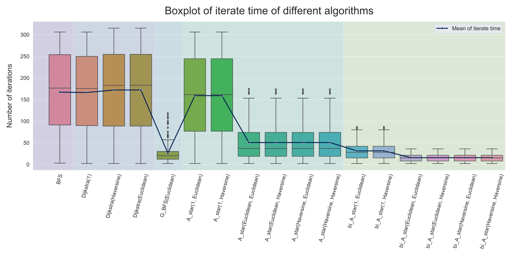

# Artificial Intelligence-Homework 3

**Name：** 张弛（ZHANG Chi）

**SID：** 12110821

**Link of pull request: **[Zhang Chi 12110821 ](https://github.com/SustechSTA303/STA303-Assignment03/pull/21)


## Introduction
In this assignment, we were asked to find the shortest path from given two stations on the London railway by using different algorithms. The algorithms I used consist of `BFS`, `Dijkstra`, `Bellman-Ford`, `Greedy BFS`, `A*,` and `Bidirectional A*`. And I used `number of it to test the performance of these algorithms. The result shows that `A*`(with cost defined by Euclidean distance and heuristics defined by Euclidean or Haversine distance) is the best algorithm to find the shortest path in the London railway.

-   Algorithm description

	-   BFS
	-   Dijkstra's Algorithm (cost)
		-   Initialize distances from the start node to all other nodes as infinity.
		-   Set the distance to the start node as 0.
		-   For each neighbor of the current node, update their distances if a shorter path (depending on **cost function**) is found.
		-   Continue until the destination is reached.
	-   Bellman-Ford Algorithm
		-   Initialize distances from the start node to all other nodes as infinity.
		-   Set the distance to the start node as 0.
		-   Repeat the following process for (number of nodes - 1) iterations: For each edge in the graph, update the distance (calculated in the **Euclidean distance**) to the destination node if a shorter path is found.
		-   Check for negative cycles: For each edge in the graph, If updating the distance to the destination node results in a shorter path, a negative cycle exists.
		-   The final distances represent the shortest paths from the start node to all other nodes.
	-   Greedy Best First Search (heuristic)
		-   Instead of searching in all directions,  in each step, it will take a step in the direction where the **heuristic function** is the smallest.
	-   A* Algorithm (cost, heuristic)
		-   Similar to Dijkstra's algorithm but it uses a **heuristic function** to estimate the cost to reach the destination from the current node.
		-   The A* algorithm combines the actual cost (from Dijkstra's) and the heuristic cost to make better decisions.
	-   Bidirectional_A* Algorithm (cost, heuristic)
		-   Similar to A*, but it can search for the shortest path from start_station and from end_station
		-   Searching until  two paths meet

-   For cost and heuristic functions, I have 3 different  measurement methods and 6 distinct combinations

	-   Functions
	    
		| Name                     | Description                                                  |
		| ------------------------ | ------------------------------------------------------------ |
		| Euclidean Distance (km)  | Straight-line distance between two stations.                 |
		| Haversine  Distance (km) | Spherical distance or great circle distance: In a spherical coordinate system, latitude and longitude indicate the position of points on the earth's surface. To calculate the actual distance between two points, I use the function `geodesic`in package `geopy` |
		| 1（only for cost）       | The time between the two subway stations is short, and there is little difference. However, the subway has experienced a process of acceleration-uniform speed-deceleration between two stations, and it takes a lot of time to stop and go at each station. So it is set to 1 to reduce the number of sites. |
		
		```python
		def function(station1: Station, station2: Station, type: str) -> float:
		    if type == "1":
		        return 1.0
		    if type == "Haversine":
		        return geodesic(station1.position, station2.position).kilometers
		    elif type == "Euclidean":
		        # Convert latitude and longitude to kilometers
		        lat_km = geodesic(
		            (station1.position[0], station1.position[1]),
		            (station1.position[0], station2.position[1]),
		        ).kilometers
		        lon_km = geodesic(
		            (station1.position[0], station1.position[1]),
		            (station2.position[0], station1.position[1]),
		        ).kilometers
		        euclidean_dist = sqrt(lat_km**2 + lon_km**2)         # Calculate Euclidean distance
		        return euclidean_dist
		```
	
-   Combinations

	| Cost function type | Heuristic type | Weight for heuristic function (to make cost and heuristic in the same order of magnitude) |
	| ------------------ | -------------- | ------------------------------------------------------------ |
	| 1                  | Euclidean      | The actual distance between London Underground stations varies depending on the location of the stations. Some stations may be closer to each other, while others may be farther away. According to the general situation, the distance between London subway stations can be between 1 and 10 kilometers. (So the weight is set to 0.001) |
	| 1                  | Haversine      | Set to 0.001                                                 |
	| Euclidean          | Euclidean      |                                                              |
	| Euclidean          | Haversine      |                                                              |
	| Haversine          | Euclidean      |                                                              |
	| Haversine          | Haversine      |                                                              |
	
-   Besides finishing the required .py file, I also created a .py file called `functions.py`, with functions `heuristics, cost,pathLength`and `random_choice`in it.


##  Experiment

### Time test

In this part, I randomly choose 200 pairs of stations by using function `random_choice`\. For each pair, I compute its `number of iterations` in all algorithms and get a table in size 200*18. 

```python
# given a number `n`, randomly choose n pairs of station
def random_choice(station_name: list, number: int) -> list:
    all_pairs = [(a, b) for a in station_name for b in station_name if a != b]
    chosen_pairs = random.sample(all_pairs, number)
    return chosen_pairs
```

> Because the amount of computation is small (See Appendix **The number of Time 0 when calculating real time**) in some functions, it is easy to have a time of 0,  which is useless for comparing, so the iteration times are used instead.



As the Bellman-Ford Algorithm iterates through all cases, here I just drop it. 

It is apparent that the **overall iteration tie of  `G_BFS`,`A_star` and `bi_A_star` are much lower than `BFS` and `Dijkstra`**, corresponding to  lower time complexity. 

- For 3 faster algorithms, `bi_A_star`is the fastest, then  G_BFS,  A_star, which is is consistent with our prior knowledge.
- For `A_star`and `bi_A_star`, we can make a conclusion deciding the **best 4 combinations: (Euclidean, Euclidean) , (Euclidean, Haversine),(Haversine, Euclidean) , (Haversine, Haversine)**. It is obvious that combinations with 1 are not that much appropriate in pathfinding.

### Path length test

To compare path lengths, I choose 5 underground lines (see Appendix **Routine chosen**) and get the shortest paths found by each algorithm. Then I compute the **Haversine distance** between every two adjacent stations and add them as the path length.

Particularly, there are algorithms with different costs or heuristic functions that can get the same result (in Appendix **Same path length in the algorithm**), so I combine them in some cases. 

According to the lineplot below (E/H stands for Euclidean or Haversine), for each algorithm, their differences are not large. And `bi_A_star(E/H, E)`'s path lengths are the shortest on each underground line.


Because there are repeated occlusions in the lineplot. Here, the mean value of the path obtained by each algorithm is plotted with a bar graph. From the figure, `bi_A_star(E/H, E/H)` and `BellmanFord` can get the shortest path.  Besides, even though `bi_A_star`and `G_BFS`are faster than `A_star`, they perform poorly in finding lower path lengths.


## Conclusion

### Main Findings

The conducted experiments involved testing various pathfinding algorithms, including `BFS, Dijkstra, Bellman-Ford, Greedy BFS, and `Bidirectional A*.` The evaluation criteria focused on the number of iterations and path length, with different costs and heuristic functions. Here are the key observations and comparisons:

- **Time Complexity:** A* exhibited superior time efficiency, with **Bidirectional A* being the fastest** among the algorithms. The results affirmed the anticipated performance trends.
- **Path Length:** 
	 - **A* with Euclidean and Haversine combinations consistently produced the shortest paths**, suggesting the effectiveness of these combinations.
	- Greedy BFS, while computationally efficient, tended to generate longer paths, emphasizing the trade-off between computation speed and path optimality.
	- Bellman-Ford also performed well in achieving minimal path lengths, but it needs more time to get the result.

The Algorithmic Choices are as follows:

- **A\*  vs.  Bidirectional A\* **
	- **Emphasis on Time Efficiency**: Bidirectional A\* demonstrates the highest time efficiency among the algorithms tested. If minimizing computational time is a priority, especially in scenarios with a large number of iterations, Bidirectional A* could be the preferred choice. Despite the Bidirectional A* path length is not the shortest, Bidirectional A* may still be advantageous in scenarios where finding paths from both start and end points simultaneously is crucial.
	- **Balanced Approach(Time and Path Length): **A\*  consistently performed well in terms of both time efficiency and path length. This combination offers a balanced approach, making it suitable for scenarios where optimizing both time and path length is important.
- **Heuristic Functions:**
	 - The data shows that the combination pairs of  Euclidean and Haversine distances are both well.
	- Haversine distance, being more accurate for geographical locations, can be a good choice in the scenario that emphasizing accurate Geographical Representation.

### Future Directions for Improvement

1.  **Introducing Noise to Heuristic Functions: **Adding controlled noise to heuristic functions may be explored to assess the algorithms' robustness in real-world, dynamic environments.
2. **Combining Multiple Heuristic Functions:** Experimenting with the combination of multiple heuristic functions, such as averaging their values, could enhance the algorithms' adaptability to diverse scenarios.
3. **Considering Transfer Time and Penalties:** Incorporating transfer time variations (e.g., differentiating between 1, 2, or 5 units) and introducing penalties for transfers could provide a more comprehensive analysis of the algorithms in a practical commuting context.
4. **Sensitivity Analysis:** Conducting sensitivity analysis on key parameters can offer insights into the algorithms' resilience to variations in input data and guide further optimization.


## Appendix

### The number of Time 0 when calculating real time


### Routine chosen for Path length test

1. Cockfosters -> Uxbridge (in blue)


2. West Ruislip -> Epping (in red)


3. Morden -> High Barnet (in black)


4. Upminster -> Richmond (in green)


5. Brixton -> Walthamstow Central (in light blue)


### Same path length in the algorithm

- For BFS， 
- For Dijkstra, they are the same
- For Bellman-Ford
- For GBFS: GBFS(Haversine), GBFS(Euclidean) same
- For A_star:
	- A_star(1,H), A_star(1,E) same
	- A_star(1,H), A_star(1,E) same
	- A_star(E,H), A_star(E,E), A_star(H,H), A_star(H,E) same
- For bi_A_star:
	- bi_A_star(1,E), bi_A_star(1,H) same
	- bi_A_star(H,E), bi_A_star(E,E) same
	- bi_A_star(H,H), bi_A_star(E,H) same